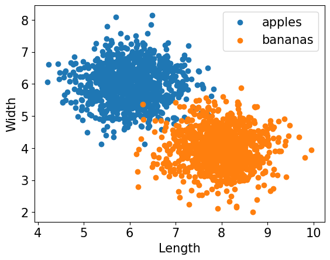
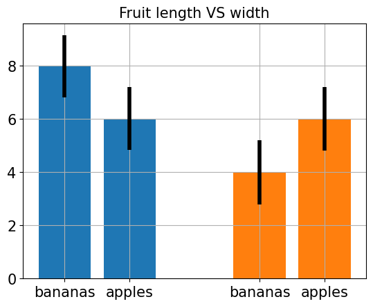
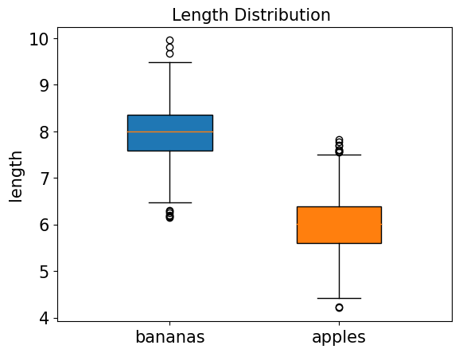
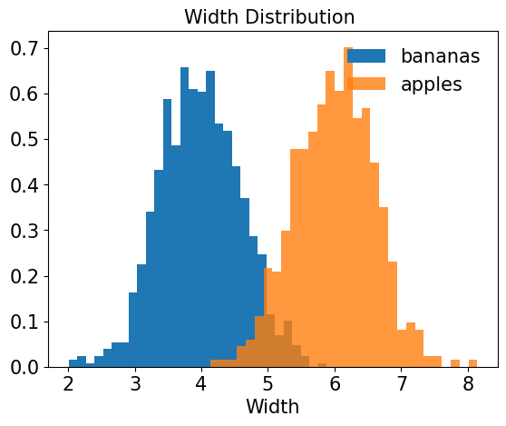
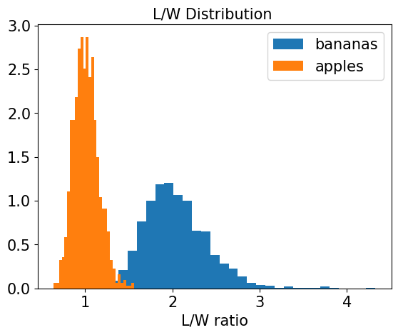
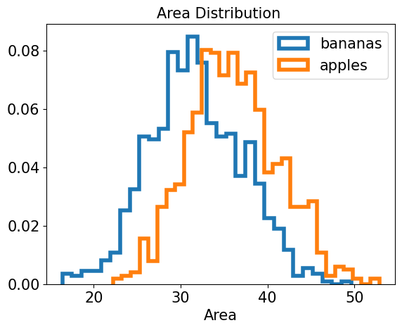
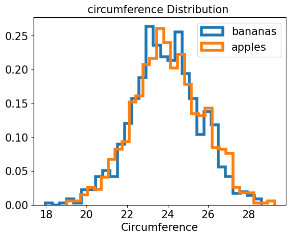
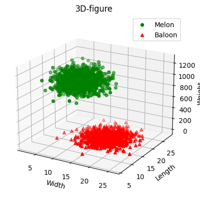

## Python Visualization
- python visualization (case) fruit classification (banana and Apple war).
> 

## 3d visualization
- A set of random data for balloons & melons with three properties of length, width and weight .
- Display the generated data in three dimensions.
>  