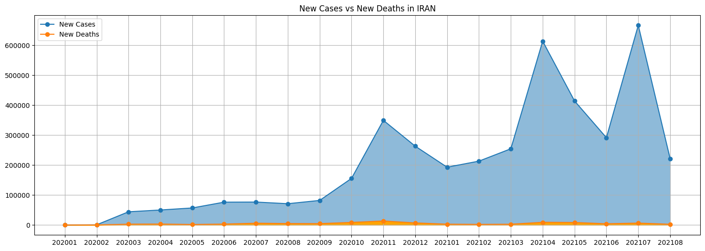

## Covid Statistics
- The eight countries with the highest number of covid cases in the fourth month of 2020.
> 

- Draw a graph that shows the mortality rate in relation to the number of cases in Iran on different days.
> 

## KNN for height/weight dataset
- Write KNN(K Nearest Neighbors) algorithm from scratch then compare with sklearn KNeighborsClassifier.
- Working on <a href='https://www.kaggle.com/mustafaali96/weight-height'>weight-height Dataset</a> on kaggle.

## KNN OCR for hand written numbers
- use kNN to build a basic OCR (Optical Character Recognition) application.
- In this case we work on a hand written numbers dataset.
- result ->  accuracy: 91.76