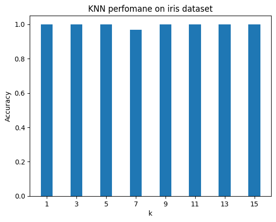

## Iris
- Doing kNN algorithm on sckit-learn Iris dataset with different k and plot the accuracy.
> 

## Abalone
- Doing kNN algorithm on <a href='https://archive.ics.uci.edu/ml/datasets/abalone'>Abalone Dataset</a> and obtain the accuracy of the algorithm.

