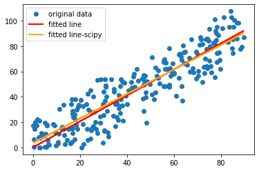

## Iris Dataset
- Drawing confusion matrix for the <a href='https://github.com/BenyaminZojaji/Machine_Learning/tree/main/Assignment35'>iris</a> problem.
> 

## LLS (Linear Least-Squares)
- Creating continuous random data for students' study hours and their grades.
> 
> 

- Draw both of them in one figure.
> 

## LLS on Boston Dataset
- Implementing the LLS method on the <a href='https://scikit-learn.org/stable/modules/generated/sklearn.datasets.load_boston.html'>Boston dataset</a> from the Scikit-learn library.
- This database offers thirteen features per house, only 'MEDV','AGE' and 'TAX' had been chosen.
- then scatter the data.
> 