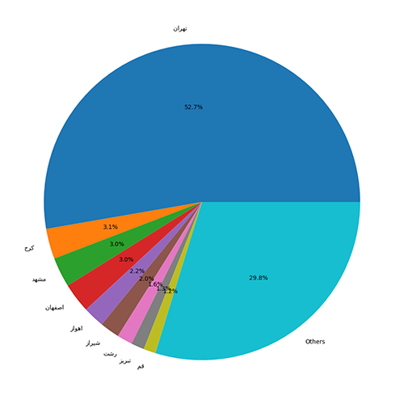
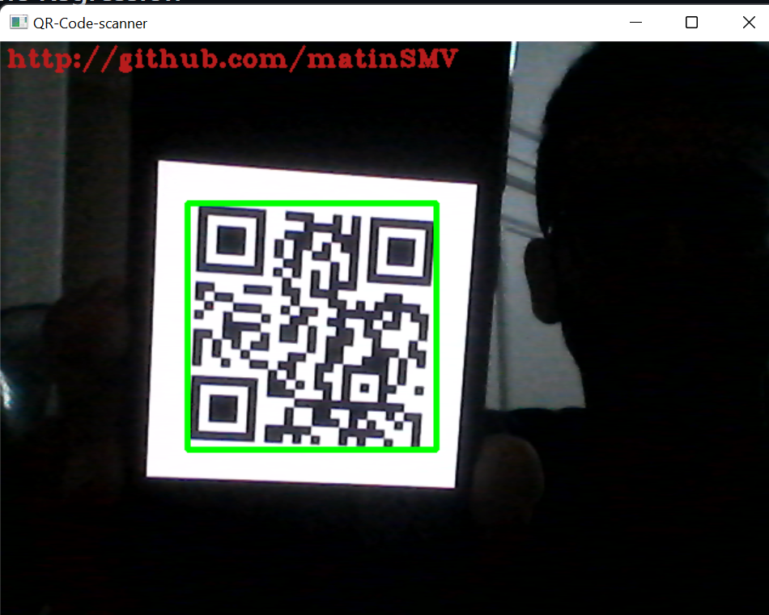

## charts on DigiKala's dataset
- EDA on DigiKala's order dataset.
- Number of orders per month:
> 
- Separate customers by city:
> 

## Analyze Abalone dataset with Regression
- Doing LLS algorithm on <a href='https://archive.ics.uci.edu/ml/datasets/abalone'>Abalone Dataset</a> and calculate MAE, MSE, Huber, and Hinge Errors.

## QR Code reader
- QR Code reader written in **python** using **opencv** detectAndDecode method that can decode QR Codes and Barcodes.
> 