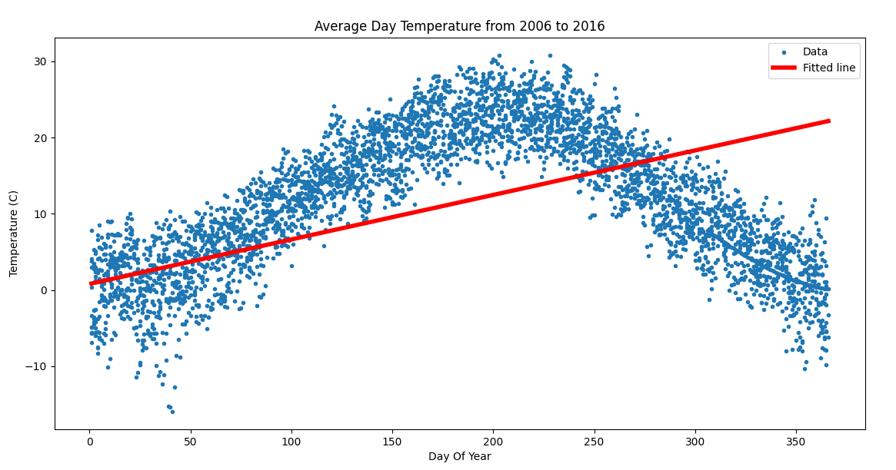
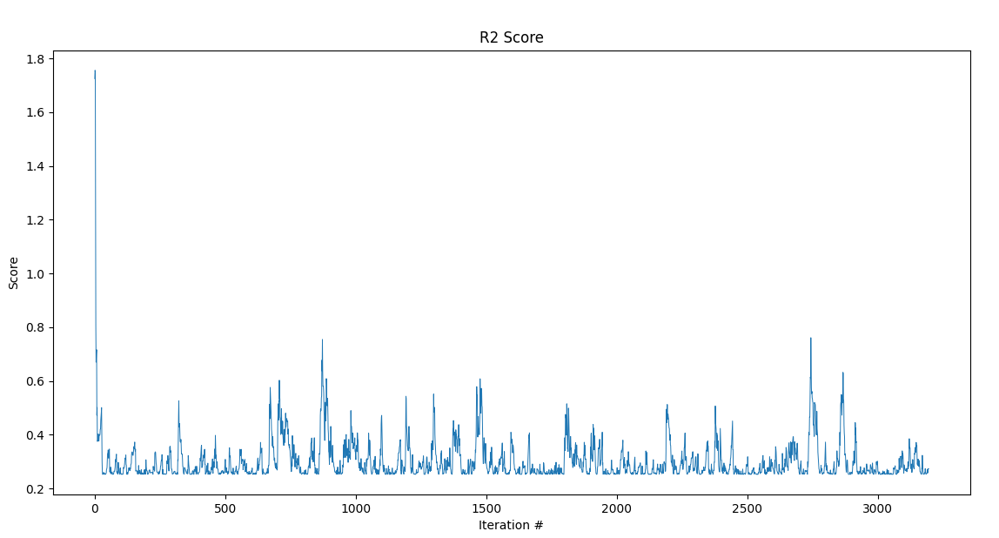
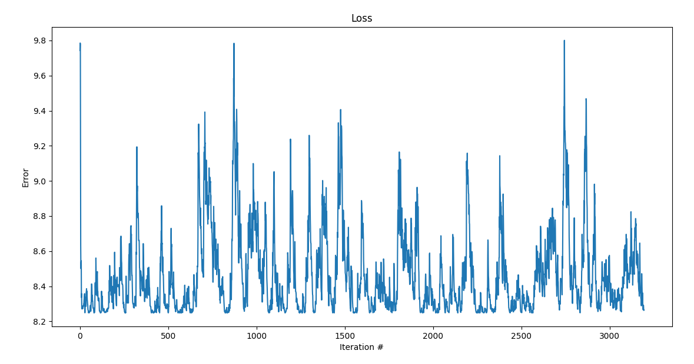

## Weather Forecast:
- The climate of a particular city is recorded every hour during different years. So, weather information is recorded 24 times per day.
- Draw an output table on a chart.
- Teach a linear model on the above data using the perceptron algorithm.
- I know that this problem won't be solved with linear regression. but here is the result

> 
- Plot Loss and R2-score diagrams.
> 

